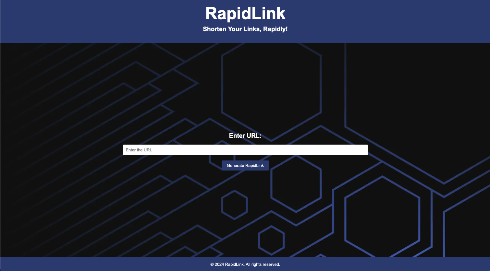
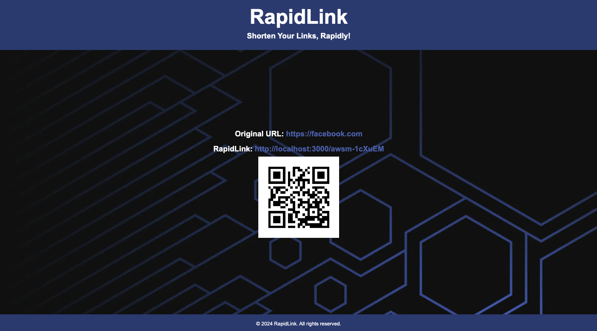

[](https://goreportcard.com/report/github.com/laurelmclean/rapidlink)

**RapidLink**

RapidLink is a simple URL shortener service and QR code generator written in Go. It provides a minimalistic web interface for shortening URLs and includes QR code generation for shortened links.


### Installation

To install RapidLink, you need to have Go installed on your system.

1. Clone the repository:

    ```
    git clone https://github.com/laurelmclean/rapidlink.git
    ```

2. Navigate to the project directory:

3. Install dependencies:

    ```
    go mod download
    ```

4. Build the project:

    ```
    go build
    ```

### Usage

1. Start the RapidLink server:

    ```
    go run main.go
    ```

2. Access RapidLink in your web browser at `http://localhost:3000`.

3. Enter the URL you want to shorten in the provided form and click on the "Generate RapidLink" button.

4. Once the URL is shortened, you will be provided with a shortened link and QR code.

### Screenshots



